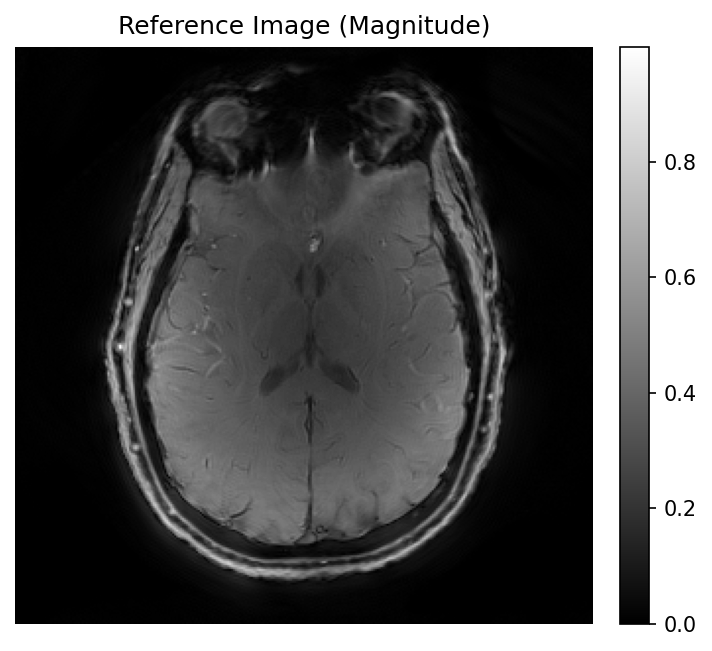
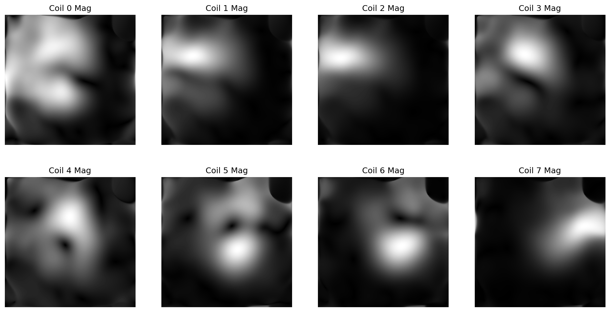
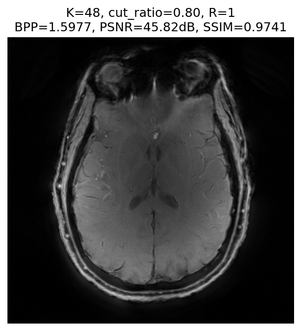
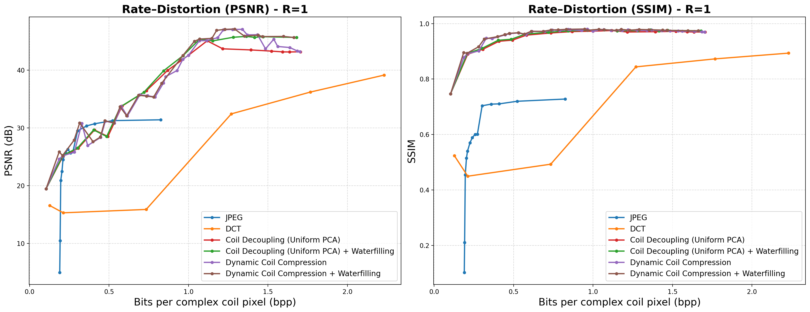

# MRI Coil Compression Methods - Rate-Distortion Analysis

This repository implements and compares various compression methods for multi-coil MRI data, evaluating their rate-distortion performance using PSNR and SSIM metrics computed on reconstructed images.
We also propose a **Dynamic K-space-aware Coil Compression** method (with waterfilling) that yields a superior Pareto frontier, significantly outperforming JPEG, DCT, and Uniform PCA baselines.

## Environment Setup

### Prerequisites
- Python 3.9+
- CUDA-capable GPU (recommended)
- Conda package manager

### Installation

1. Create and activate the conda environment:
```bash
conda create -n ee274_project_env python=3.9
conda activate ee274_project_env
```

2. Install required packages:
```bash
pip install torch numpy scipy matplotlib sigpy scikit-image pillow tqdm
```

## How to Run

### Run All Experiments

To run all compression methods sequentially:

```bash
conda activate ee274_project_env
python run_all.py
```

This will execute:
1. Reference image generation (0_generate_reference)
2. JPEG compression
3. DCT compression
4. Uniform PCA coil compression (Regular & Waterfilling)
5. Dynamic Coil Compression (Regular & Waterfilling) - including hyperparameter search and optimal runs

### Run Individual Experiments

You can also run individual scripts (no PYTHONPATH setup needed):

```bash
# Generate reference image
python scripts/0_generate_reference.py

# JPEG compression
python scripts/compression/jpeg_compression.py

# DCT compression
python scripts/compression/DCT_compression.py

# Uniform PCA compression
python scripts/compression/uniform_coil_compression.py
# Uniform PCA compression (Waterfilling)
python scripts/compression/uniform_coil_compression.py --waterfilling

# Dynamic Coil Compression (Generate sweep data)
python scripts/compression/dynamic_coil_compression.py
python scripts/compression/dynamic_coil_compression.py --waterfilling

# Dynamic Coil Compression (Find Optimal Hyperparameters)
python scripts/compression/find_optimal_hyperparameters_for_dcc.py
python scripts/compression/find_optimal_hyperparameters_for_dcc.py --waterfilling

# Dynamic Coil Compression (Run Optimal)
python scripts/compression/run_optimal_dynamic_compression.py
python scripts/compression/run_optimal_dynamic_compression.py --waterfilling
```

### Generate Rate-Distortion Curves

To plot the combined rate-distortion curves for all methods:

```bash
python plot_rd_all.py
```

This generates plots in `results/plot/`.

## Method Descriptions

### 0_generate_reference: Reference Image Generation

**Purpose**: Generates the ground truth reference image for evaluation.

**Input Data Path**:
- Raw multi-coil complex images are loaded from:  
  `dataset/imgs.pt`  
  *(Replace `DATASET_NAME` with your actual dataset folder name.)*

**Method**:
- Loads multi-coil complex images (shape: 64 × 294 × 294)
- Converts to k-space
- Estimates coil sensitivity maps using the ESPIRiT algorithm [(Uecker et al., 2014)](https://ieeexplore.ieee.org/document/6876307)
- Combines coil images using sensitivity-weighted combination
- Normalizes the final image

**Output**: 
- `results/reference/ref_image.pt`: Reference combined image
- `results/reference/sensitivity_maps.pt`: Estimated sensitivity maps




**Key Parameters**:
- Calibration region: 32×32 center k-space
- ESPIRiT threshold: 0.02
- Kernel width: 6

---

### jpeg_compression: JPEG Compression

**Purpose**: Baseline JPEG compression [(Pennebaker & Mitchell, 1992)](https://ieeexplore.ieee.org/document/210764) applied to coil images.

**Method**:
- Separates real and imaginary components of coil images
- Tiles all coil images into a mosaic
- Applies JPEG compression to real and imaginary mosaics separately
- Reconstructs coil images from compressed mosaics
- Uses ESPIRiT to combine coils into final image

**Hyperparameters**:
- JPEG quality: [1, 5, 10, 15, 20, 30, 40, 50, 60, 70, 80, 85, 90, 95, 98, 100]

**Output**: 
- `results/compression_result/jpeg_compression/results_jpeg.pt`: Rate-distortion results
- Individual reconstructed images for each quality setting

**Characteristics**:
- Simple baseline method
- Works in image domain
- Moderate compression efficiency
- Quality degrades at low bit rates

---

### DCT_compression: DCT Compression

**Purpose**: 2D Discrete Cosine Transform compression with magnitude-based coefficient selection.

**Method**:
- Applies 2D DCT to real and imaginary components separately
- Performs global magnitude-based thresholding
- Keeps top-k DCT coefficients by magnitude across all coils
- Quantizes and compresses remaining coefficients using zlib
- Reconstructs via inverse DCT

**Hyperparameters**:
- Keep ratio: [0.005, 0.01, 0.05, 0.1, 0.15, 0.2, 0.3, 0.5]
- Quantization bits: 9

**Output**: 
- `results/compression_result/dct_compression/results_dct.pt`: Rate-distortion results

**Characteristics**:
- Frequency-domain compression
- Global coefficient selection optimizes rate-distortion
- Good performance at medium bit rates
- Preserves important frequency components


### uniform_coil_compression: PCA-Based Uniform Compression

**Purpose**: Principal Component Analysis (PCA) for uniform coil compression.

**Method**:
- Reshapes coil images into vectors
- Computes covariance matrix across coils
- Performs eigendecomposition
- Selects top-K principal components
- Projects data onto PCA basis
- Quantizes and compresses PCA coefficients
- Stores PCA basis vectors (overhead)
- Reconstructs via inverse PCA transform
- **Waterfilling Variant**: An optional bit allocation strategy where quantization precision is scaled based on the singular values (waterfilling), implemented with the option '--waterfilling'.

**Hyperparameters**:
- PCA rank (K): [1, 2, 3, 4, 5, 6, 8, 10, 12, 14, 16, 20, 24, 28, 32]
- Quantization bits: 8

**Output**: 
- `results/compression_result/uniform_coil_compression/results_pca.pt`: Rate-distortion results

**Characteristics**:
- Exploits correlation across coils
- Global basis shared across all spatial locations
- Basis overhead becomes significant at low ranks
- Outperforms two baselines (JPEG, DCT), confirming the importance of inter-coil correlations

---

### dynamic_coil_compression: Dynamic Coil Compression

**Purpose**: Adaptive compression using PCA coil compression followed by variable-radius k-space masking (corner cutting) per virtual coil.

**Method**:
- **PCA Stage**: Applies a global PCA basis (derived from calibration data) to decouple coils into virtual coils.
- **Dynamic Masking**: Applies a circular mask to each virtual coil in k-space.
  - The radius of the mask is determined by the virtual coil's importance (singular value).
  - High-energy virtual coils keep more high-frequency content (larger radius).
  - Low-energy virtual coils are aggressively filtered (smaller radius).
- **Waterfilling Variant**: An optional bit allocation strategy where quantization precision is scaled based on the singular values (waterfilling), implemented with the option '--waterfilling'.

**Hyperparameters**:
- PCA rank (K): Adaptive (grid search in `find_optimal_hyperparameters_for_dcc.py`)
- Cut Ratio: Controls how quickly mask radius decays with singular value rank.

**Output**: 
- `results/compression_result/dynamic_coil_compression/`: Raw sweep results
- `results/compression_result/dynamic_coil_compression_waterfilling/`: Raw waterfilling results
- `results/compression_result/dynamic_coil_compression/optimal/`: Optimal results after hyperparameter search

**Characteristics**:
- optimized to preserve energy where it matters most (principal components).
- **Dynamic k-space Masking and Waterfilling** push the performance further. By adapting to k-space energy, they yield higher SSIM at lower bit rates than the Coil Decoupling baseline.



---

## Rate-Distortion Results

Results are saved in `results/plot/` as .png files.



The rate–distortion curves compare all methods using:

- **X-axis**: Bits per complex coil pixel (bpp)
- **Y-axis**: PSNR (dB) or SSIM (if specified)

### Key Observations

1. **JPEG compression**  
   - Serves as a simple baseline and sanity check.  
   - Weaker than DCT at moderate and high bit rates, but becomes competitive and often the strongest among the non-PCA methods at very low bit rates.


2. **DCT transform compression**  
   - Strongest among the non-PCA baselines at medium and high bit rates.  
   - Outperforms JPEG in this regime by selecting the largest DCT coefficients globally across coils.


3. **Coil Decoupling (PCA-based uniform coil compression)**  
   - Consistently outperforms two non-PCA baselines (JPEG, DCT) across the entire bit-rate range.  
   - For a given bit rate, it achieves the highest SSIM (and PSNR), confirming that explicitly modeling coil correlations with a global PCA basis is highly effective for multi-coil MRI compression.

4. **Dynamic Coil Compression**
   - Dynamic k-space Masking and Waterfilling push the performance further.
   - By adapting to k-space energy, they yield higher reconstruction quality at lower bit rates than Coil Decoupling baseline.

Overall, the proposed **Dynamic K-space-aware Coil Compression with waterfilling** method outperforms all baselines, including JPEG, DCT, and Coil Decoupling.


## File Structure

```
EE274_dynamic_coil_compression/
├── README.md
├── run_all.py                 # Main script to run all experiments
├── plot_rd_all.py            # Generate combined RD curves
├── scripts/
│   ├── 0_generate_reference.py
│   ├── scripts_for_visualization.ipynb
│   └── compression/
│       ├── jpeg_compression.py
│       ├── DCT_compression.py
│       ├── uniform_coil_compression.py
│       ├── dynamic_coil_compression.py
│       ├── find_optimal_hyperparameters_for_dcc.py
│       └── run_optimal_dynamic_compression.py
├── utils/
│   ├── mri_utils.py           # MRI processing utilities
│   ├── espirit_torch.py       # ESPIRiT implementation
│   └── plot_utils.py          # Plotting utilities
└── results/
    ├── reference/             # Reference images
    ├── compression_result/
    │   ├── jpeg_compression/
    │   ├── dct_compression/
    │   ├── uniform_coil_compression/
    │   ├── uniform_coil_compression_waterfilling/
    │   ├── dynamic_coil_compression/
    │   └── dynamic_coil_compression_waterfilling/
    └── plot/                  # Combined RD plots as .png files
```

## Notes

- All compression methods are evaluated using PSNR and SSIM computed on **ESPIRiT-reconstructed complex images**.
- BPP (bits per pixel) is calculated as total bits / (N_coils × H × W).
- ESPIRiT is used for final image reconstruction in all methods.
- Results are saved as PyTorch tensors for easy loading and analysis.

## References

### ESPIRiT (Parallel MRI / Sensitivity Maps)

M. Uecker, P. Lai, M. J. Murphy, P. Virtue, M. Elad, J. M. Pauly, S. S. Vasanawala, and M. Lustig,

"ESPIRiT—an eigenvalue approach to autocalibrating parallel MRI: where SENSE meets GRAPPA,"

*Magnetic Resonance in Medicine*, vol. 71, no. 3, pp. 990–1001, 2014.

### Array / Coil Compression (PCA)

M. Buehrer, K. P. Pruessmann, P. Boesiger, and S. Kozerke,

"Array compression for MRI with large coil arrays,"

*Magnetic Resonance in Medicine*, vol. 57, no. 6, pp. 1131–1139, 2007.

### Compressed Sensing MRI (Sparse MRI)

M. Lustig, D. Donoho, and J. M. Pauly,

"Sparse MRI: The application of compressed sensing for rapid MR imaging,"

*Magnetic Resonance in Medicine*, vol. 58, no. 6, pp. 1182–1195, 2007.

### Compressed Sensing MRI (Overview / Tutorial)

M. Lustig, D. Donoho, and J. M. Pauly,

"Compressed sensing MRI,"

*IEEE Signal Processing Magazine*, vol. 25, no. 2, pp. 72–82, 2008.

### Variable-Density Poisson-Disc Sampling

R. Bridson,

"Fast Poisson-disk sampling in arbitrary dimensions,"

*ACM SIGGRAPH 2007 Sketches & Applications*, Article No. 22, 2007.

### JPEG Still Image Compression

G. K. Wallace,

"The JPEG still picture compression standard,"

*Communications of the ACM*, vol. 34, no. 4, pp. 30–44, 1991.

